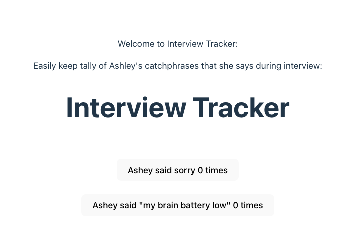

# Sorry Mini-Counter

A really basic two button app, created just for laughs. 
Users can click the buttons to count the occurences of my two most popular catchprases during an interview, during a day at work, or whenever. The idea was inspired by a mock interview I had where the person noted me apologizing a lot and said he would keep a tally on a piece of paper. I decided why not "automate" tallying? ;) And with that- and with some React, I turned my quirk into something fun and playful. 

