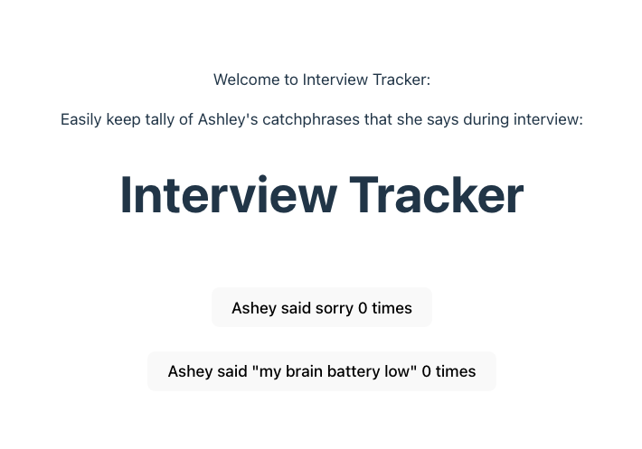

# Sorry Mini-Counter

---

# Intro

A really basic two button app, created just for laughs. 
Users can click the buttons to count the occurences of my two most popular catchprases during an interview, during a day at work, or whenever. The idea was inspired by a mock interview I had where the person noted me apologizing a lot and said he would keep a tally on a piece of paper. I decided why not "automate" tallying? ;) And with that- and with some React, I turned my quirk into something fun and playful. 

Here is a link to my app https://sorry-counter.netlify.app/.

---

# Functionality

Using React's `useState` hook, I manage two counters: sorryCount and brainCount. These counters start at zero and increase each time their respective buttons are clicked. Everyday, like clockwork, you will hear me say "sorry" or "my brain battery is low."

Each button is equipped with an `onClick` handler that utilizes an anonymous function to update the state. This function takes the current state (`sorryCount` or `brainCount`) and increments it by one. 

This approach ensures that the count is always updated based on its latest value, preventing any potential issues with stale state, especially when updates happen in quick succession (cough, like maybe when I'm super struggle-bussing on a Leetcode and I say sorry as I work my way through it >_<)
React handles the dynamic updates seamlessly, so every time a button is clicked, the new count is displayed immediately on the screen.

And this my friends shows how coding can bring laughter, and how we can use it to find humor in what would be a tough mock interview week. <3

